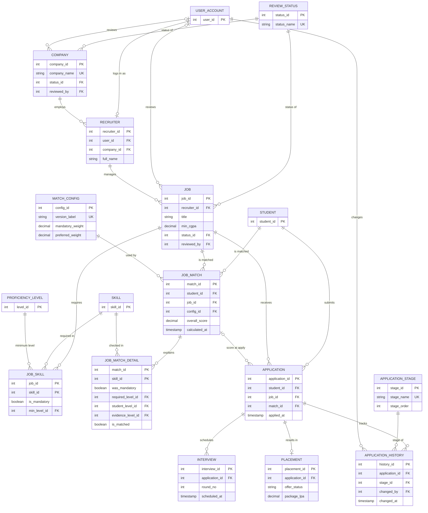

# ER Diagram 2: Companies, Jobs, Matching and Applications

Tables from Diagram 1 that appear here again (STUDENT, SKILL, PROFICIENCY_LEVEL, USER_ACCOUNT) are shown with their key columns only.

```mermaid
erDiagram
    REVIEW_STATUS ||--o{ COMPANY : "status of"
    REVIEW_STATUS ||--o{ JOB : "status of"
    USER_ACCOUNT |o--o{ COMPANY : reviews
    USER_ACCOUNT |o--o{ JOB : reviews
    USER_ACCOUNT ||--o| RECRUITER : "logs in as"
    COMPANY ||--o{ RECRUITER : employs
    RECRUITER ||--o{ JOB : manages
    JOB ||--o{ JOB_SKILL : requires
    SKILL ||--o{ JOB_SKILL : "required in"
    PROFICIENCY_LEVEL ||--o{ JOB_SKILL : "minimum level"
    STUDENT ||--o{ JOB_MATCH : "is matched"
    JOB ||--o{ JOB_MATCH : "is matched"
    MATCH_CONFIG ||--o{ JOB_MATCH : "used by"
    JOB_MATCH ||--o{ JOB_MATCH_DETAIL : explains
    SKILL ||--o{ JOB_MATCH_DETAIL : "checked in"
    STUDENT ||--o{ APPLICATION : submits
    JOB ||--o{ APPLICATION : receives
    JOB_MATCH |o--o{ APPLICATION : "score at apply"
    APPLICATION ||--o{ APPLICATION_HISTORY : tracks
    APPLICATION_STAGE ||--o{ APPLICATION_HISTORY : "stage of"
    USER_ACCOUNT ||--o{ APPLICATION_HISTORY : changes
    APPLICATION ||--o{ INTERVIEW : schedules
    APPLICATION ||--o| PLACEMENT : "results in"

    USER_ACCOUNT {
        int user_id PK
    }
    STUDENT {
        int student_id PK
    }
    SKILL {
        int skill_id PK
    }
    PROFICIENCY_LEVEL {
        int level_id PK
    }
    REVIEW_STATUS {
        int status_id PK
        string status_name UK
    }
    COMPANY {
        int company_id PK
        string company_name UK
        int status_id FK
        int reviewed_by FK
    }
    RECRUITER {
        int recruiter_id PK
        int user_id FK
        int company_id FK
        string full_name
    }
    JOB {
        int job_id PK
        int recruiter_id FK
        string title
        decimal min_cgpa
        int status_id FK
        int reviewed_by FK
    }
    JOB_SKILL {
        int job_id PK
        int skill_id PK
        boolean is_mandatory
        int min_level_id FK
    }
    MATCH_CONFIG {
        int config_id PK
        string version_label UK
        decimal mandatory_weight
        decimal preferred_weight
    }
    JOB_MATCH {
        int match_id PK
        int student_id FK
        int job_id FK
        int config_id FK
        decimal overall_score
        timestamp calculated_at
    }
    JOB_MATCH_DETAIL {
        int match_id PK
        int skill_id PK
        boolean was_mandatory
        int required_level_id FK
        int student_level_id FK
        int evidence_level_id FK
        boolean is_matched
    }
    APPLICATION {
        int application_id PK
        int student_id FK
        int job_id FK
        int match_id FK
        timestamp applied_at
    }
    APPLICATION_STAGE {
        int stage_id PK
        string stage_name UK
        int stage_order
    }
    APPLICATION_HISTORY {
        int history_id PK
        int application_id FK
        int stage_id FK
        int changed_by FK
        timestamp changed_at
    }
    INTERVIEW {
        int interview_id PK
        int application_id FK
        int round_no
        timestamp scheduled_at
    }
    PLACEMENT {
        int placement_id PK
        int application_id FK
        string offer_status
        decimal package_lpa
    }
```