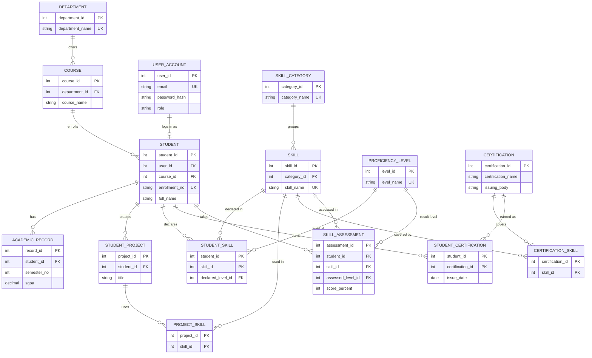

# ER Diagram 1: Students, Skills and Certifications

```mermaid
erDiagram
    DEPARTMENT ||--o{ COURSE : offers
    COURSE ||--o{ STUDENT : enrolls
    USER_ACCOUNT ||--o| STUDENT : "logs in as"
    STUDENT ||--o{ ACADEMIC_RECORD : has
    STUDENT ||--o{ STUDENT_PROJECT : creates
    SKILL_CATEGORY ||--o{ SKILL : groups
    STUDENT ||--o{ STUDENT_SKILL : declares
    SKILL ||--o{ STUDENT_SKILL : "declared in"
    PROFICIENCY_LEVEL ||--o{ STUDENT_SKILL : "level of"
    STUDENT_PROJECT ||--o{ PROJECT_SKILL : uses
    SKILL ||--o{ PROJECT_SKILL : "used in"
    CERTIFICATION ||--o{ CERTIFICATION_SKILL : covers
    SKILL ||--o{ CERTIFICATION_SKILL : "covered by"
    STUDENT ||--o{ STUDENT_CERTIFICATION : earns
    CERTIFICATION ||--o{ STUDENT_CERTIFICATION : "earned as"
    STUDENT ||--o{ SKILL_ASSESSMENT : takes
    SKILL ||--o{ SKILL_ASSESSMENT : "assessed in"
    PROFICIENCY_LEVEL ||--o{ SKILL_ASSESSMENT : "result level"

    USER_ACCOUNT {
        int user_id PK
        string email UK
        string password_hash
        string role
    }
    DEPARTMENT {
        int department_id PK
        string department_name UK
    }
    COURSE {
        int course_id PK
        int department_id FK
        string course_name
    }
    STUDENT {
        int student_id PK
        int user_id FK
        int course_id FK
        string enrollment_no UK
        string full_name
    }
    ACADEMIC_RECORD {
        int record_id PK
        int student_id FK
        int semester_no
        decimal sgpa
    }
    STUDENT_PROJECT {
        int project_id PK
        int student_id FK
        string title
    }
    SKILL_CATEGORY {
        int category_id PK
        string category_name UK
    }
    SKILL {
        int skill_id PK
        int category_id FK
        string skill_name UK
    }
    PROFICIENCY_LEVEL {
        int level_id PK
        string level_name UK
    }
    STUDENT_SKILL {
        int student_id PK
        int skill_id PK
        int declared_level_id FK
    }
    PROJECT_SKILL {
        int project_id PK
        int skill_id PK
    }
    CERTIFICATION {
        int certification_id PK
        string certification_name
        string issuing_body
    }
    CERTIFICATION_SKILL {
        int certification_id PK
        int skill_id PK
    }
    STUDENT_CERTIFICATION {
        int student_id PK
        int certification_id PK
        date issue_date
    }
    SKILL_ASSESSMENT {
        int assessment_id PK
        int student_id FK
        int skill_id FK
        int assessed_level_id FK
        int score_percent
    }
```